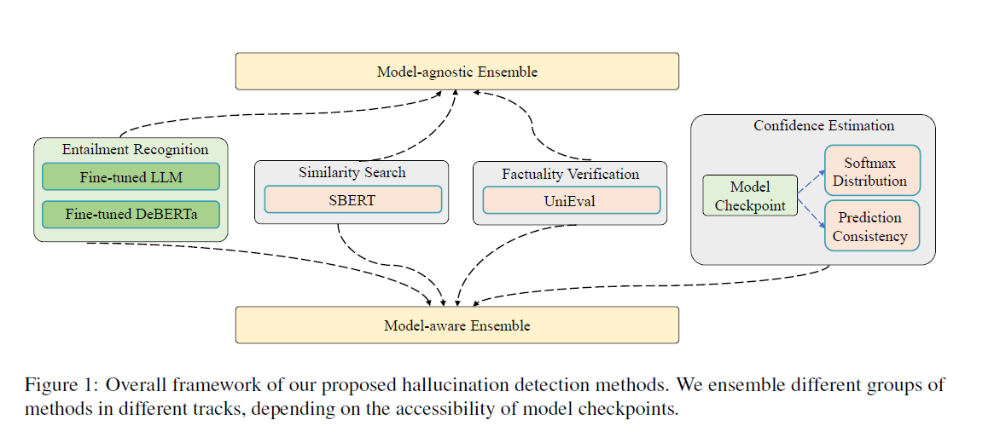
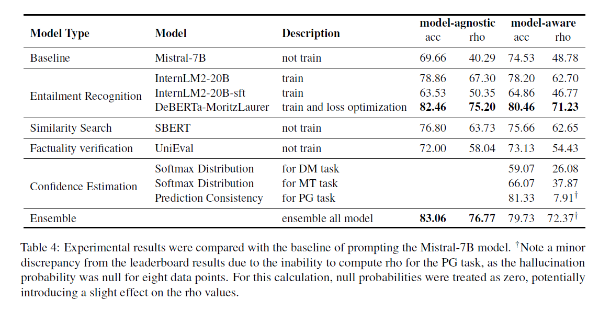

# semeval2024-task6-hallucination-detection

This paper describes our submission for SemEval-2024 Task 6: SHROOM, a Shared-task on Hallucinations and Related Observable Overgeneration Mistakes. We propose four groups of methods for hallucination detection: 1) Entailment Recognition; 2) Similarity Search; 3) Factuality Verification; 4) Confidence Estimation. The four methods rely on either the semantic relationship between the hypothesis and its source (target) or on the model-aware features during decoding. We participated in both the model-agnostic and model-aware tracks. Our method's effectiveness is validated by our high rankings 3rd in the model-agnostic track and 5th in the model-aware track.

## LLM-based Data Construction

The code in GPT-4-to-label-the-training-set.ipynb

Due to the lack of annotation data, it is difficult to incorporate task-oriented optimization for the pre-trained models. However, both tracks provide unannotated data with the form of [source, target, hypothesis]. Therefore, we propose to derive hallucination annotation by ourselves, leveraging the intelligence ability of proprietary LLMs, such as GPT-4. Based on the different tasks, we provide the paired text to the LLM, and design the prompt template to detect whether there is hallucination in the hypothesis.

## Main Results

* fine-tuning LLM: fine-tuning-LLM

* deberta: deberta-separately-for-each-task-train.py, deberta-loss-optimized-parameter-adjustment.py and deberta-loss-optimized-train.py

* sbert and unieval: sbert-and-unieval.ipynb

* model aware feature augmentation: model-aware-feature-augmentation.ipynb

